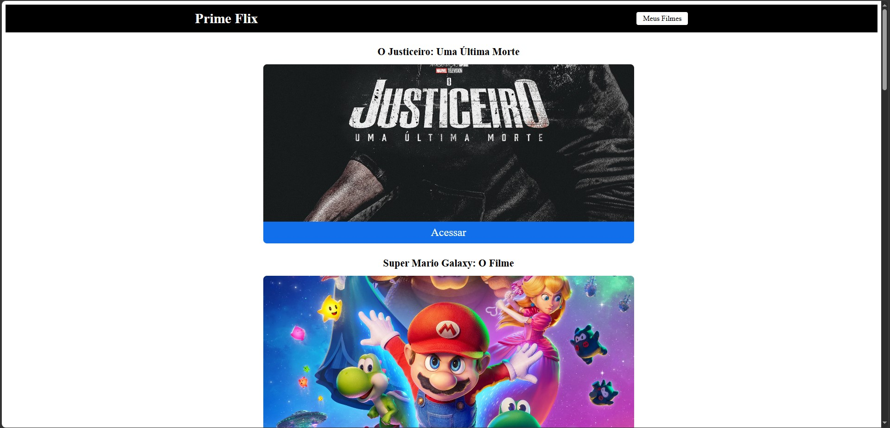
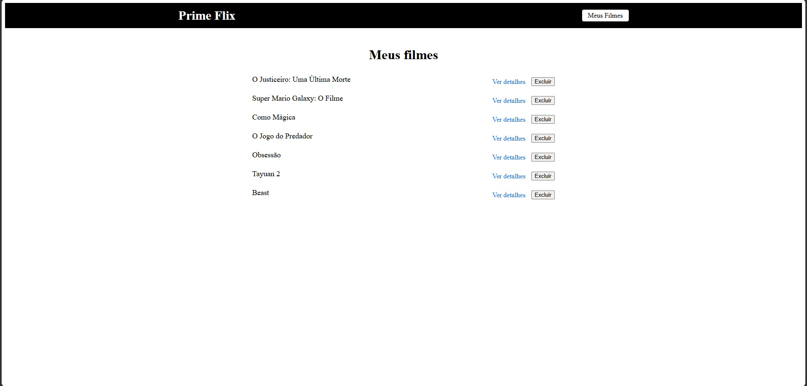

# 🎬 Prime Flix

O **Prime Flix** é uma aplicação web interativa desenvolvida em React para os entusiastas do cinema. A plataforma consome dados de filmes em tempo real, permitindo aos usuários navegar pelas produções em destaque, acessar detalhes detalhados (sinopse, avaliação) e gerenciar uma lista personalizada de "Meus Filmes" favoritados através do armazenamento local (LocalStorage).

---

## 📸 Demonstração do Sistema

Abaixo estão as principais interfaces da aplicação, projetadas com foco em uma experiência de usuário limpa e intuitiva:

### 🏠 Painel Principal (Catálogo de Filmes)
Interface inicial que exibe os filmes em alta, com opções rápidas para acessar os detalhes de cada produção.


### 📂 Seção Meus Filmes (Favoritos)
Espaço dedicado onde o usuário gerencia sua lista personalizada, podendo visualizar detalhes ou remover títulos salvos.


---

## 🚀 Tecnologias Utilizadas

- **Biblioteca Core:** React.js (Componentização e Hooks)
- **Roteamento:** React Router DOM (Navegação SPA entre catálogo e favoritos)
- **Consumo de API:** Axios para requisições assíncronas HTTP
- **Persistência de Dados:** LocalStorage API para salvar os filmes favoritos no navegador do usuário
- **Estilização:** CSS3 puro com foco em design responsivo e Dark Mode moderno

---

## 🛠️ Funcionalidades Principais

- **Listagem Dinâmica:** Busca automática dos filmes mais populares através de integração com API de cinema.
- **Persistência de Favoritos:** Salve seus filmes preferidos para assistir mais tarde. Os dados não somem ao atualizar a página.
- **Gerenciamento de Lista:** Interface simplificada para exclusão de filmes salvos na aba "Meus Filmes".
- **Feedback Visual:** Alertas dinâmicos ao salvar ou remover itens da lista.

---

## ⚙️ Como Executar o Projeto

Siga os passos abaixo para rodar a aplicação localmente em ambiente de desenvolvimento.

### Pré-requisitos
Antes de começar, você vai precisar ter instalado em sua máquina:
- [Node.js](https://nodejs.org/) (Versão LTS recomendada).

### Passo a Passo

1. **Clonar o Repositório:**
   ```bash
   git clone [https://github.com/PaulloMaggio/PrimeFlix.git](https://github.com/PaulloMaggio/PrimeFlix.git)
   cd PrimeFlix
Instalar as Dependências:

Bash
npm install
Iniciar o Servidor de Desenvolvimento:

Bash
npm start
O painel será aberto automaticamente no seu navegador pelo endereço http://localhost:3000.

👤 Desenvolvedor
Projeto desenvolvido por Paulo Magio. Se quiser trocar ideias sobre desenvolvimento de software ou acompanhar minha evolução na stack, conecte-se comigo:

LinkedIn: linkedin.com/in/paulo-magio

GitHub: @PaulloMaggio

💎 Prime Flix — Seu guia definitivo de cinema.